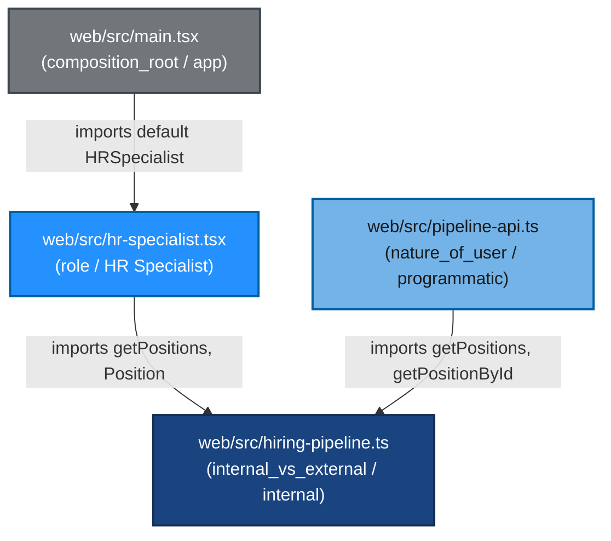

# Dependency Graph — Scenario 1: View Active Hiring Pipeline

Module structure after iteration 3 (Extract Module → `pipeline-api.ts`).

Dependency arrows point from **less important** (delivery / boundary) → **more important** (domain). The composition-root sits at the top; tests mount components directly via the test driver.

## Mermaid graph

## Importance ordering

| Tier | Module | Facet/Axis | Reason |
|---|---|---|---|
| 1 (most important) | `web/src/hiring-pipeline.ts` | internal_vs_external / internal | Pure domain — Position type, PIPELINE_DATA, in-process accessors. Zero imports. |
| 2 | `web/src/hr-specialist.tsx` | role / HR Specialist | Human UI delivery — renders the pipeline table; consumes domain accessors. |
| 2 | `web/src/pipeline-api.ts` | nature_of_user / programmatic | HTTP boundary adapter — token-based auth + request dispatch; consumes domain accessors. |
| 3 (least important) | `web/src/main.tsx` | composition_root / app | Framework wiring — `createRoot` + CSS imports + render `<HRSpecialist />`. |

## Dependency rule verification

- `hr-specialist.tsx` (less important, UI) → `hiring-pipeline.ts` (more important, domain) ✓
- `pipeline-api.ts` (less important, HTTP boundary) → `hiring-pipeline.ts` (more important, domain) ✓
- `main.tsx` (composition root) → `hr-specialist.tsx` (UI) — composition roots wire up the application; the dependency rule does not apply to composition roots in the normal way.
- `hiring-pipeline.ts` imports nothing from the codebase; it is the leaf domain module.

No reverse-direction imports. No translation in the more-important module. Boundaries between adapters and domain are simple (Position records, primitive id strings).
