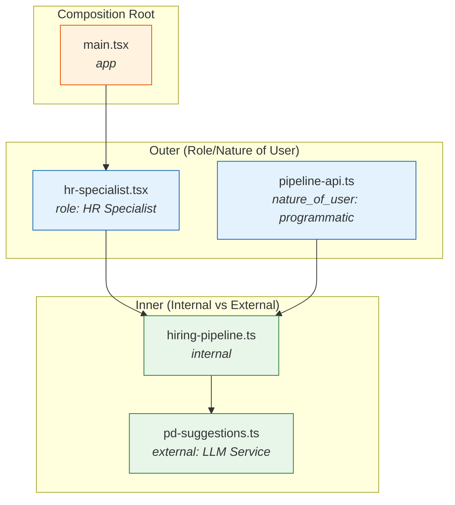

# Dependency Graph — Scenario 2

```mermaid
graph TD
    subgraph "Outer (Role/Nature of User)"
        HR["hr-specialist.tsx<br/><i>role: HR Specialist</i>"]
        API["pipeline-api.ts<br/><i>nature_of_user: programmatic</i>"]
    end

    subgraph "Inner (Internal vs External)"
        HP["hiring-pipeline.ts<br/><i>internal</i>"]
        PD["pd-suggestions.ts<br/><i>external: LLM Service</i>"]
    end

    subgraph "Composition Root"
        MAIN["main.tsx<br/><i>app</i>"]
    end

    HR --> HP
    API --> HP
    HP --> PD
    MAIN --> HR

    classDef outer fill:#e3f2fd,stroke:#1565c0
    classDef inner fill:#e8f5e9,stroke:#2e7d32
    classDef root fill:#fff3e0,stroke:#e65100

    class HR,API outer
    class HP,PD inner
    class MAIN root
```
